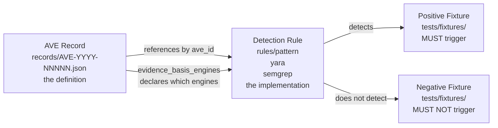

# ARCHITECTURE.md — bawbel/ave

Update this file before closing any PR that changes the record structure,
adds a new rule engine category, or changes how records and rules relate.

---

## What this repo is

A standard, not software. The architecture is the schema, the record store,
the rules that implement detection, and the validation tooling.

```
records/              AVE record JSON files — the standard's data
schema/               JSON schema the records validate against
  ave-record.schema.json             alias — always points to current
  ave-record-1.1.0.schema.json       versioned canonical — current, permanent
  ave-record-1.0.0.schema.json       versioned canonical — frozen, permanent
rules/                Detection rule implementations
  ├── pattern/        Regex pattern rules (Python)
  ├── yara/           YARA rules (.yar)
  └── semgrep/        Semgrep rules (.yaml)
tests/fixtures/       Positive and negative test files per rule
scripts/              Validation and coverage tooling
crosswalks/           Mappings from other scanners and frameworks to AVE ids
docs/                 ADRs, guides, research reports
```

---

## The record → rule → fixture triangle



Every record must have all four corners. A record with no rule is a
definition nobody can detect. A rule with no negative fixture is a
false-positive risk with no guard.

---

## How the scanner consumes this repo

```
bawbel/ave (this repo)              bawbel/scanner (consumer)
──────────────────────              ─────────────────────────
records/*.json          ──load──▶   AVE record lookup
rules/pattern/*.py       ──load──▶   PatternEngine
rules/yara/*.yar         ──load──▶   YARAEngine
rules/semgrep/*.yaml     ──load──▶   SemgrepEngine

record.confidence_baseline  ──────▶  starting confidence for a Finding
record.evidence_kind_default ─────▶  Finding.evidence_kind default
record.detection_stage       ─────▶  Finding.evidence_stage floor
record.derivable_into        ─────▶  ToxicFlow chain candidates
```

PiranhaDB also ingests records/ and serves them at api.piranha.bawbel.io.
The ave-site build script reads records/ to generate the public registry.

---

## The five detection layers

Every AVE record declares a `detection_layer` — where in the agent ecosystem the vulnerability
class surfaces. This determines what kind of scanner or monitoring reaches it.

```
Ecosystem location          Layer              Scanner that reaches it
─────────────────────────   ─────────────────  ──────────────────────────────────
Skill / prompt file body    content            Static file scanner (bawbel scan)
MCP server manifest         server_card        Server-card scanner (bawbel scan-server-card)
Registry listing            registry_metadata  Registry audit
Live agent execution        runtime            Behavioral sandbox / runtime monitor
Network layer               transport          Proxy / network monitor
```

**content** is the most common layer (33 of 48 records). The payload is text in the file body.
A static scanner catches it before the agent ever runs. This is the layer bawbel-scanner covers
primarily.

**server_card** means the injection is in the MCP server manifest — `.well-known/mcp.json`, tool
description fields, or parameter schemas. The agent reads this before making its first tool call.
Scannable by fetching the manifest and running the same content rules.

**registry_metadata** means the attack is in the registry listing itself — a typosquatted server
name, a false vendor claim in the publisher field. Detectable by auditing the registry before
installation.

**runtime** means the evidence only exists during a live agent session. The injected payload
arrives as a tool result, a memory write, an A2A message, a rendered UI artifact, or an async
task payload. No static scanner sees this. Requires a behavioral sandbox or runtime monitoring.
12 records are at this layer — they are the hardest to defend against because they bypass
pre-deployment scanning entirely.

**transport** means the attack is in the network layer — a redirected OAuth endpoint, a manipulated
Host header, a poisoned DNS response. Requires a proxy or network monitor.

---

## The declares → assigns contract

The record declares baselines and defaults. The scanner assigns per-detection
actuals. This is the key relationship — it is what lets two different
implementations of AVE produce consistent evidence metadata.

```
AVE RECORD declares            SCANNER assigns to FINDING
──────────────────             ──────────────────────────
confidence_baseline   ──────▶  confidence (then FP-adjusted)
evidence_kind_default ──────▶  evidence_kind
detection_stage       ──────▶  evidence_stage (the actual stage reached)
evidence_basis_engines──────▶  evidence_basis (engines that fired)
derivable_into        ──────▶  ToxicFlow.derived_from_findings
```

A record never carries a confidence number for a specific detection.
It carries the baseline. The scanner does the per-detection math.

This separation is why confidence belongs on a Finding, not a record:
the same class detected in a docs/ folder and in a live skill file
deserves different confidence. The standard declares the starting point;
each implementation adjusts from it.

---

## ADR status

| ADR | Decision |
|---|---|
| 0001 | Behavioral fingerprints over byte signatures |
| 0002 | ave_id is immutable once published — deprecated, never renumbered or deleted |
| 0003 | Records declare evidence baselines; scanners assign per-detection actuals |