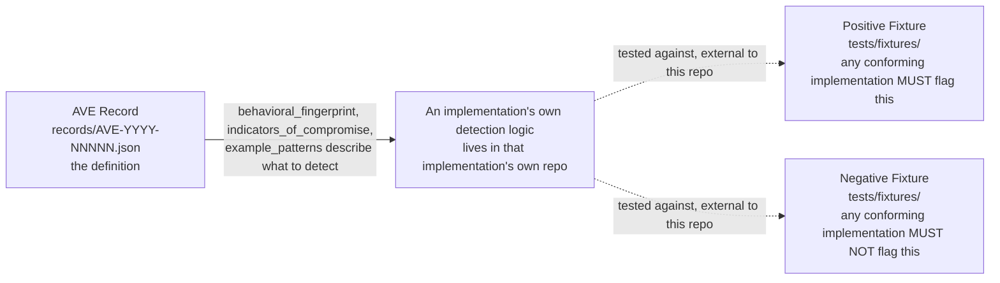

# ARCHITECTURE.md — aveproject/ave

Update this file before closing any PR that changes the record structure
or changes how records and conformance fixtures relate.

---

## What this repo is

A standard, not software. The architecture is the schema, the record store,
the conformance fixtures, and the validation tooling.

```
records/              AVE record JSON files, the standard's data
schema/               JSON schema the records validate against
  ave-record.schema.json             alias, always points to current
  ave-record-1.1.0.schema.json       versioned canonical, current, permanent
  ave-record-1.0.0.schema.json       versioned canonical, frozen, permanent
tests/fixtures/       Positive and negative conformance fixtures per record.
                       Any implementation's own detection logic is tested
                       against these; the logic itself lives in that
                       implementation's own repo, not here. See "record and
                       conformance fixture" below.
scripts/               Validation and coverage tooling
crosswalks/            Mappings from other scanners and frameworks to AVE ids
docs/                  ADRs, guides, research reports
```

There is no `rules/` directory in this repo. Detection rule implementations
(pattern matching, YARA, semgrep, or anything else) are implementation
artifacts, not standard artifacts, and live in whichever tool implements
against this standard, `bawbel-scanner` included. Shipping one
implementation's rules here would make this repo describe one product
instead of a standard any product can implement against; see `CONTEXT.md`'s
framing discipline.

---

## The record and conformance fixture relationship



Every record should have fixtures. A record with no fixtures is a definition
nobody has a shared, neutral way to verify detection against. The dotted
lines are deliberate: this repo owns the record and the fixtures an
implementation is measured against, not the implementation itself. A second
implementer proves conformance by passing these fixtures with their own
rules, not by adopting `bawbel-scanner`'s.

---

## How an implementation consumes this repo

```
aveproject/ave (this repo)              a conforming implementation
──────────────────────              ─────────────────────────
records/*.json          ──load──▶   AVE record lookup

record.confidence_baseline  ──────▶  starting confidence for a Finding
record.evidence_kind_default ─────▶  Finding.evidence_kind default
record.detection_stage       ─────▶  Finding.evidence_stage floor
record.derivable_into        ─────▶  ToxicFlow chain candidates
```

The `ave-site` build script reads `records/` to generate the public registry;
that is standard infrastructure, not a third-party consumer. Any other
service consuming these records, including any Bawbel-operated one, is an
implementation of the standard and is documented in its own repo, not here,
per `CONTEXT.md`.

---

## The five detection layers

Every AVE record declares a `detection_layer` — where in the agent ecosystem the vulnerability
class surfaces. This determines what kind of scanner or monitoring reaches it.

```
Ecosystem location          Layer              What reaches it
─────────────────────────   ─────────────────  ──────────────────────────────────
Skill / prompt file body    content            A static file scanner, pre-execution
MCP server manifest         server_card        A server-card fetcher, before first tool call
Registry listing            registry_metadata  A registry audit process
Live agent execution        runtime            A behavioral sandbox or runtime monitor
Network layer               transport          A proxy or network monitor
```

**content** is the most common layer (37 of 59 records). The payload is text in the file body.
A static scanner catches it before the agent ever runs, no live execution required, which is why
this layer is the easiest for any implementation to cover first.

**server_card** means the injection is in the MCP server manifest — `.well-known/mcp.json`, tool
description fields, or parameter schemas. The agent reads this before making its first tool call.
Scannable by fetching the manifest and running the same content rules.

**registry_metadata** means the attack is in the registry listing itself — a typosquatted server
name, a false vendor claim in the publisher field. Detectable by auditing the registry before
installation.

**runtime** means the evidence only exists during a live agent session. The injected payload
arrives as a tool result, a memory write, an A2A message, a rendered UI artifact, or an async
task payload. No static scanner sees this. Requires a behavioral sandbox or runtime monitoring.
15 records are at this layer — they are the hardest to defend against because they bypass
pre-deployment scanning entirely.

**transport** means the attack is in the network layer — a redirected OAuth endpoint, a manipulated
Host header, a poisoned DNS response. Requires a proxy or network monitor.

---

## The declares → assigns contract

The record declares baselines and defaults. The scanner assigns per-detection
actuals. This is the key relationship — it is what lets two different
implementations of AVE produce consistent evidence metadata.

```
AVE RECORD declares            SCANNER assigns to FINDING
──────────────────             ──────────────────────────
confidence_baseline   ──────▶  confidence (then FP-adjusted)
evidence_kind_default ──────▶  evidence_kind
detection_stage       ──────▶  evidence_stage (the actual stage reached)
evidence_basis_engines──────▶  evidence_basis (engines that fired)
derivable_into        ──────▶  ToxicFlow.derived_from_findings
```

A record never carries a confidence number for a specific detection.
It carries the baseline. The scanner does the per-detection math.

This separation is why confidence belongs on a Finding, not a record:
the same class detected in a docs/ folder and in a live skill file
deserves different confidence. The standard declares the starting point;
each implementation adjusts from it.

---

## ADR status

| ADR | Decision |
|---|---|
| 0001 | Behavioral fingerprints over byte signatures |
| 0002 | ave_id is immutable once published — deprecated, never renumbered or deleted |
| 0003 | Records declare evidence baselines; scanners assign per-detection actuals |