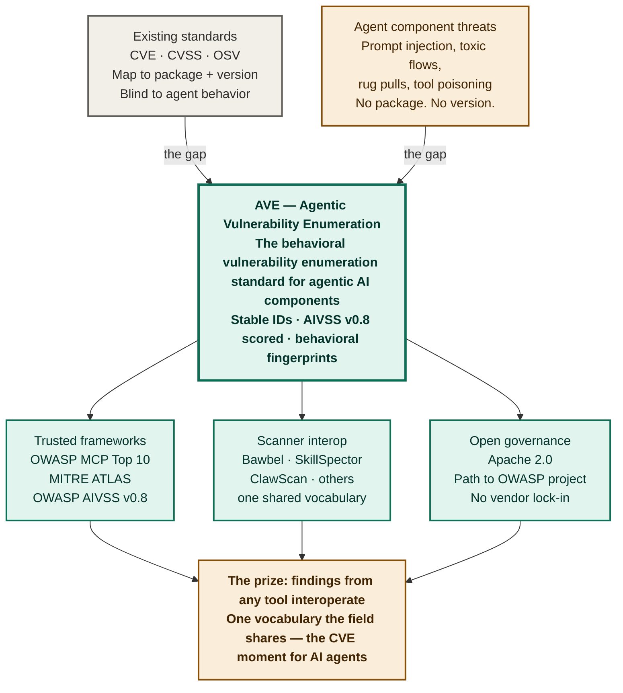
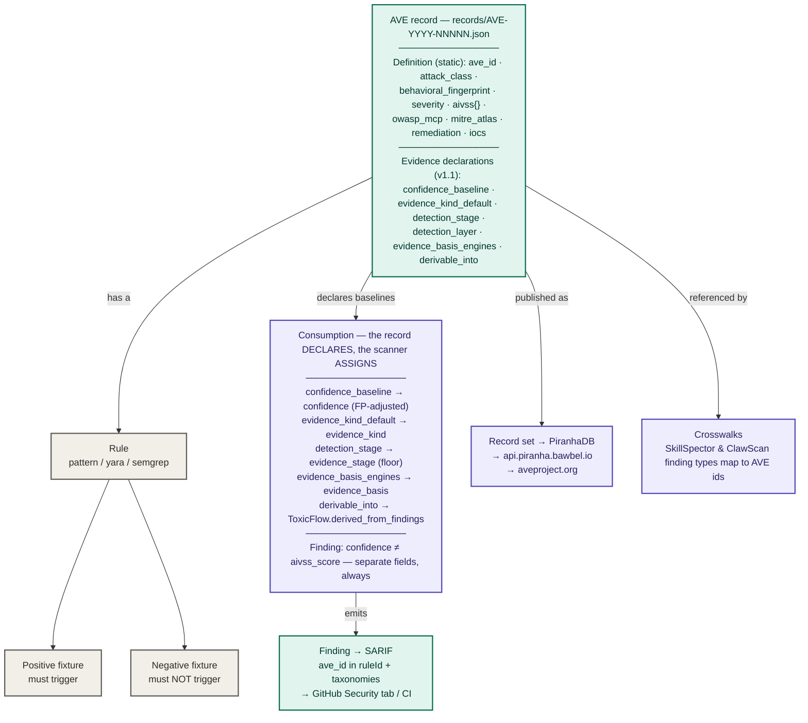

# AVE Architecture

This document explains the AVE standard at two levels:

1. A high-level view for partners, adopters, and decision-makers — what AVE
   is and why it matters.
2. A detailed view for developers and security engineers — how an AVE record
   is structured, validated, consumed, and emitted.

If you read only one section, read the one for your role. The two describe
the same standard at different depths.

---

## 1. High-level view (partners, adopters, decision-makers)

### The diagram

### The gap AVE fills

Conventional vulnerability standards were built for conventional software.
CVE identifies a flaw, CVSS scores its severity, and OSV maps it to a
specific package and version range. This works because traditional
vulnerabilities live in code you can pin to a release.

Agent component threats do not work this way. A prompt injection hidden in
an MCP tool description, a skill file that fetches its real instructions from
a remote URL, a rug pull that changes behavior after install, a toxic flow
that chains two individually-benign capabilities into an exfiltration path —
none of these map to a package and version. The same malicious behavior
appears in infinitely many textual forms, and the danger is in what the
component *does*, not in which dependency it pulls.

That is the gap. The existing standards are blind to it because there is no
package to flag and no version range to constrain. AVE exists to enumerate
these behavioral vulnerability classes the way CVE enumerates software flaws.

### What AVE is

AVE (Agentic Vulnerability Enumeration) is an open standard that assigns a
stable identifier to each distinct behavioral vulnerability class in agentic
AI. Each record describes the behavior that makes a component dangerous,
scores it with OWASP AIVSS v0.8, and maps it to the frameworks the security
field already uses. It is behavioral, not signature-based: one AVE record
catches many textual variants of the same underlying attack.

AVE is a standard, not a product. The Bawbel scanner implements it, but AVE
is designed to be implemented by anyone. The record set is published openly;
the schema is open; the identifiers are stable and citable.

### Why it wins — three pillars

**Trusted frameworks.** Every AVE record maps to OWASP MCP Top 10, the
OWASP Agentic AI Top 10, MITRE ATLAS, and is scored with OWASP AIVSS v0.8.
AVE does not ask anyone to abandon a framework they trust — it gives them a
machine-readable, lintable way to enforce those frameworks in a pipeline.

**Scanner interoperability.** The field has many scanners and no shared
vocabulary. Independent studies have found that different agent-security
scanners barely agree on what they flag — overlap between any two tools can
be in the single digits of a percent. That is not a quality problem; it is a
vocabulary problem. Without a common reference, findings from two tools
cannot be compared, deduplicated, or aggregated. AVE is the shared reference
that makes cross-tool findings interoperate.

**Open governance.** As long as a standard is owned by one company, adopters
fear lock-in. AVE is published under Apache 2.0 with an explicit path toward
neutral governance as an OWASP project. The standard is meant to outlive any
single implementation, including Bawbel's.

### The prize

If the field adopts one vocabulary, findings from any tool interoperate, and
a security team can finally compare and correlate results across scanners.
That is the position AVE is built to occupy — the CVE moment for AI agents.

---

## 2. Detailed view (developers and security engineers)

### The diagram

### Anatomy of a record

An AVE record is a single JSON file at `records/AVE-YYYY-NNNNN.json` that
validates against `schema/ave-record.schema.json` (currently v1.1). It has
two conceptual halves.

**The static definition** is the part that describes the vulnerability class
itself and never changes per scan:

- `ave_id` — the immutable identifier. Once published it is never renumbered
  or reused. A wrong record is deprecated via `status`, never deleted.
- `attack_class` — the behavioral category (for example
  `external_instruction_fetch`), not a "vulnerability type" string.
- `behavioral_fingerprint` — what the component *does* that is dangerous.
  Behavioral, not a byte signature. This is the heart of the record.
- `severity` and `aivss` — the OWASP AIVSS v0.8 breakdown (`cvss_base`,
  `aars`, `thm`, `mitigation_factor`, `aivss_score`, `spec_version`).
  Severity and score must agree: CRITICAL implies `aivss_score >= 9.0`.
- `owasp_mcp`, `owasp`, `mitre_atlas` — framework mappings.
- `remediation`, `indicators_of_compromise`, `references`.

**The evidence declarations** were added in schema v1.1 (issues #69-72).
They are all optional, so every pre-v1.1 record still validates. They do not
carry per-detection values — they declare the *defaults and baselines* a
scanner uses to assign per-finding evidence metadata:

- `confidence_baseline` — the base confidence for a single-engine match
  before false-positive adjustment.
- `evidence_kind_default` — the default `evidence_kind` for findings of this
  class.
- `detection_stage` — the earliest lifecycle stage at which this class is
  detectable (`static_detection`, `runtime_observed`, `runtime_drift_detected`).
- `detection_layer` — where the class surfaces (`content`, `server_card`,
  `registry_metadata`, `runtime`).
- `evidence_basis_engines` — which engines can detect this class.
- `derivable_into` — the toxic-flow chains this class can participate in.

### Validation — the record/rule/fixture triangle

A definition nobody can detect is not useful, and a detection with no
false-positive guard is a liability. Every record therefore requires three
things beyond the JSON:

1. A **rule** (`pattern`, `yara`, or `semgrep`) that implements detection and
   references the `ave_id`.
2. A **positive fixture** — a file that must trigger the rule.
3. A **negative fixture** — a benign file that resembles the positive one but
   must *not* trigger the rule. This is the false-positive guard, and a rule
   without one is incomplete.

The validation tooling in `scripts/` enforces that every record has a rule
and that every rule has both fixtures. `pytest` runs the rules against the
fixtures and fails if a positive fixture stops triggering or a negative
fixture starts.

### Consumption — the record declares, the scanner assigns

This is the most important concept for anyone implementing AVE, and the
reason the v1.1 evidence fields exist.

An AVE **record** is static. A scanner **Finding** is a runtime instance —
one detection of one file at one moment. Confidence belongs to the Finding,
never to the record: the same class detected in a `docs/` folder and in a
live skill file deserves different confidence. So the record never carries a
`confidence` number. Instead it declares the baseline, and the scanner does
the per-detection math:

| Record DECLARES (static) | Scanner ASSIGNS to Finding (runtime) |
|---|---|
| `confidence_baseline` | `confidence` (then FP-adjusted) |
| `evidence_kind_default` | `evidence_kind` |
| `detection_stage` | `evidence_stage` (floor) |
| `evidence_basis_engines` | `evidence_basis` |
| `derivable_into` | `ToxicFlow.derived_from_findings` |

The invariant that falls out of this: in any Finding, `confidence` and
`aivss_score` are separate fields with separate meaning and are never merged
or substituted. AIVSS answers "how bad would this be"; confidence answers
"how sure are we." A HIGH-severity, low-confidence finding and a HIGH-severity,
high-confidence finding require different responses, and the output keeps
them distinct.

Putting the baselines in the standard rather than in scanner code is
deliberate. If the scanner hardcoded them, a second implementation would
invent its own and the two tools would produce divergent evidence metadata
for the same class. Baselines belong in the standard so every implementation
agrees. (See `docs/adr/0003-records-declare-baselines.md`.)

### What stays out of the record

These are per-detection runtime values. They live only on the scanner
Finding, never in an AVE record: `confidence`, `confidence_band`, the actual
`evidence_stage` reached, `confidence_reason`, `derived`, `line`, `match`,
`suppressed`, and the engine that actually fired.

### Output and distribution

- **SARIF.** A scanner emits Findings as SARIF with the `ave_id` in `ruleId`
  and referenced under `taxonomies`, plus `aivss_score`, `confidence`,
  `owasp_mcp`, and `mitre_atlas` in the properties bag. Because SARIF is
  already consumed by the GitHub Security tab and CI systems, AVE ids travel
  into those surfaces for free.
- **PiranhaDB and the public site.** The record set is ingested by PiranhaDB
  (the deploy-time `sync_records.py` export) and served at
  `api.piranha.bawbel.io` and the public registry at `aveproject.org`.
- **Crosswalks.** Published mappings let other scanners' finding types
  (SkillSpector's categories, ClawScan's types) resolve to AVE ids, so
  findings from different tools become comparable through the AVE layer.

### Adding a record

Use the `add-ave-record` skill. To keep the standard current with real
research without padding it, use the `research-new-attack-classes` skill,
which benchmarks the threat landscape against existing records and only
proposes a new record when a genuinely distinct behavioral class exists.

---

## Related documents

- `schema/ave-record.schema.json` — the record schema (v1.1)
- `docs/guides/schema-vs-finding.md` — record vs Finding in depth
- `docs/adr/0001-behavioral-fingerprints.md` — behavioral over signature
- `docs/adr/0002-immutable-ave-id.md` — why ids never change
- `docs/adr/0003-records-declare-baselines.md` — the declares/assigns split
- `docs/guides/aibom-alignment.md` — how records feed an OWASP AIBOM